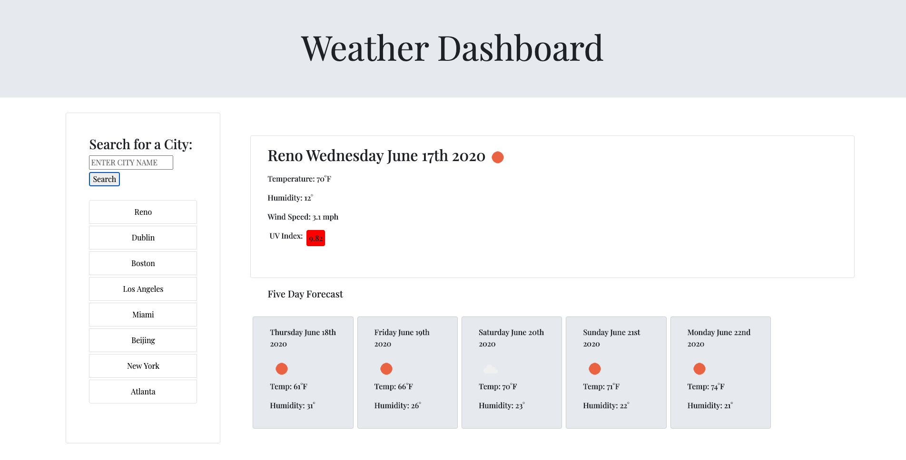

# Weather-Dashboard

In this project I utilized multiple API's from openweathermap.org. Using AJAX calls to retrieve information from these API's, I was able to create a responsive site that allows users to input a city, anywhere in the world, and easily retrieve a daily weather forecast, as well as a five-day forecast, for that city. 

The functionality of the page is reliant on both jQuery and vanilla javaScript. The user's search history is saved to localStorage and displayed on a sidebar with fully functional buttons, so the user can look at the cities they previously searched and easily access the weather data from those cities. 

Finally, the site was designed to load the weather data from the most recently viewed city the user chose, and display that city's weather data upon site entry. 

[Deployed link](https://gary-bergman.github.io/Weather-Dashboard/)

[My github](https://github.com/Gary-Bergman)

